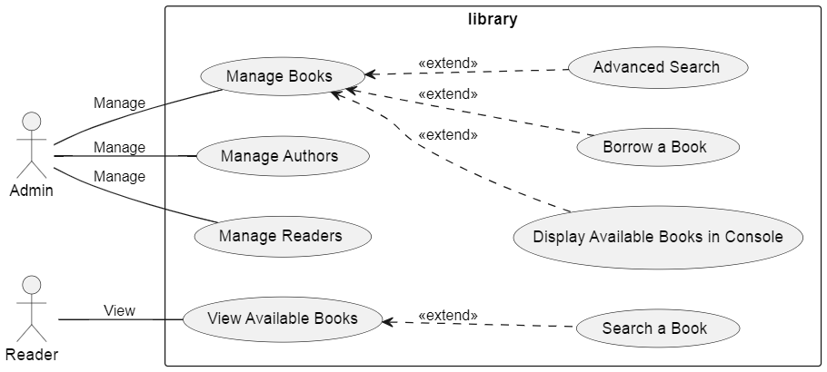

# Rapport de projet : 
## Gestion de bibliothèque en PHP POO

### 1- Introduction :
#### Ce projet, réalisé dans le cadre de la "Semaine SAS", vise à initier les participants à la programmation orientée objet (POO) en PHP. L’objectif est de développer une application console pour gérer un système de bibliothèque, tout en mettant en pratique les principes fondamentaux de la POO. Cette application permet de gérer les livres, les auteurs, les lecteurs, ainsi que le suivi des emprunts. En plus de l'apprentissage de la POO, le projet inclut l'utilisation de fichiers JSON pour la persistance des données et explore les techniques de déploiement d’une application PHP..

---

### 2- Context de projet : 
#### Ce programme est conçu pour enseigner aux étudiants les bases du développement logiciel, en particulier la programmation orientée objet (POO). Le choix de la gestion d'une bibliothèque comme thème permet d'aborder des concepts concrets tels que la gestion du cycle de vie des objets (livres, auteurs, lecteurs) et leur interaction au sein du système. Les participants apprennent ainsi à appliquer des principes de POO, tels que l'encapsulation, l'héritage et les relations entre classes.
#### L'application propose des fonctionnalités essentielles comme l'ajout, la modification et la suppression de livres et de lecteurs, ainsi que la gestion des emprunts. La persistance des données est assurée via des fichiers JSON, et le projet inclut un déploiement en PHP pour offrir une meilleure compréhension de l'ensemble du cycle de développement et de mise en production.

---

### 3- Développement agile  : 
#### Le développement Agile est une approche flexible et itérative qui vise à fournir des versions fonctionnelles du logiciel de manière régulière, en répondant aux besoins changeants des utilisateurs. Dans ce chapitre, nous allons d’abord expliquer les principes fondamentaux de l’Agilité, ses avantages et ses limites. Ensuite, nous allons nous concentrer sur Scrum, l’une des méthodes Agile les plus populaires, en expliquant ses rôles clés, ses événements, ses artefacts et les bonnes pratiques pour réussir un projet Scrum

---

### 4- Processus de développement  : ( 2TUP )
#### Le processus 2TUP ( 2 Track Unified Process ) est une méthodologie de développement logiciel qui s'appuie sur le Processus Unifié. Il débute par une étude préliminaire qui inclut : 
+ L'identification des acteurs interagissant avec le système à développer.
+ L'élaboration d'un cahier des charges.
+ La modélisation du contexte.

#### Le processus se décompose ensuite en trois phases essentielles :
1. **Branche fonctionnelle :** Cette phase consiste à modéliser et à créer des maquettes pour clarifier les besoins fonctionnels.
2. **Branche technique :** Elle recense toutes les contraintes à respecter pour réaliser le système et définit les composants nécessaires à la construction de l'architecture technique.
3. **Phase de réalisation :** Cette étape intègre les deux branches, permettant de concevoir l'application et de livrer une solution adaptée aux besoins identifiés. Elle se conclut par une étape de codage suivie d'une phase de recette, visant à valider les fonctionnalités du système développé.

---

### 5- Planification : 
#### Dans le cadre de notre projet, nous avons mis en place un tableau de gestion pour organiser les différentes tâches à réaliser. Ce tableau, structuré par jour de la semaine, a permis de suivre l'avancement des activités de manière efficace. ce qui facilite la priorisation et la répartition des efforts tout au long du projet. Cette approche méthodique a été cruciale pour garantir le respect des délais et la bonne exécution des différentes étapes du projet.
**Tableau de Gestion des tâches :**
| Jour      | Tâche 1       | Tâche 2       | Tâche 3                       |
| --------- | ------------- | ------------- | ----------------------------- |
| Vendredi  | ---           | OOP           | OOP                           |
| Mercredi  | Autoformation | Veille        | Autoformation                 |
| Jeudi     | Autoformation | Veille        | Analyse/Conception            |
| Vendredi  | Autoformation | Prototype     | logo/groupe name/veille list  |
| Lundi     | Prototype     | Prototype     | Prototype                     |
| Mardi     | Deployment    | Deployment    | Deployment                    |
| Lundi     | Réalisation   | Réalisation   | Réalisation                   |
| Mardi     | Réalisation   | Réalisation   | Réalisation                   |
| Mercredi  | Réalisation   | Réalisation   | Réalisation                   |

---

### 5- Branche fonctionnelle : 
#### Ce chapitre se concentre sur la branche fonctionnelle, essentielle dans le développement logiciel, où l'analyse des besoins et les cas d'utilisation jouent un rôle clé. L'objectif est de comprendre comment un système doit fonctionner pour répondre aux attentes des utilisateurs. En identifiant les acteurs, leurs objectifs et les interactions avec le système, nous pouvons définir clairement les fonctionnalités nécessaires. Cette approche permet de s'assurer que le produit final est en adéquation avec les besoins réels des utilisateurs, constituant ainsi une étape fondamentale dans le processus de développement.
**Cas d'utilisation :**
